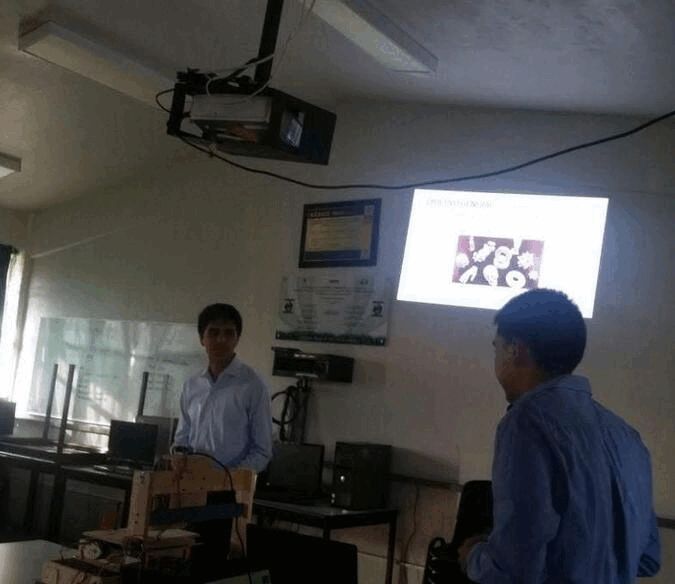
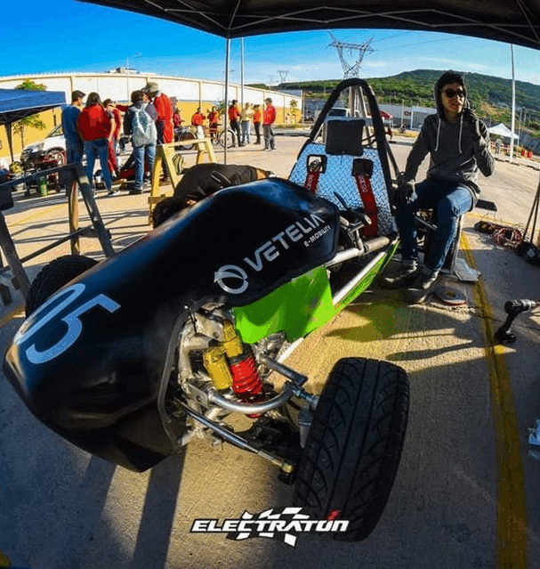
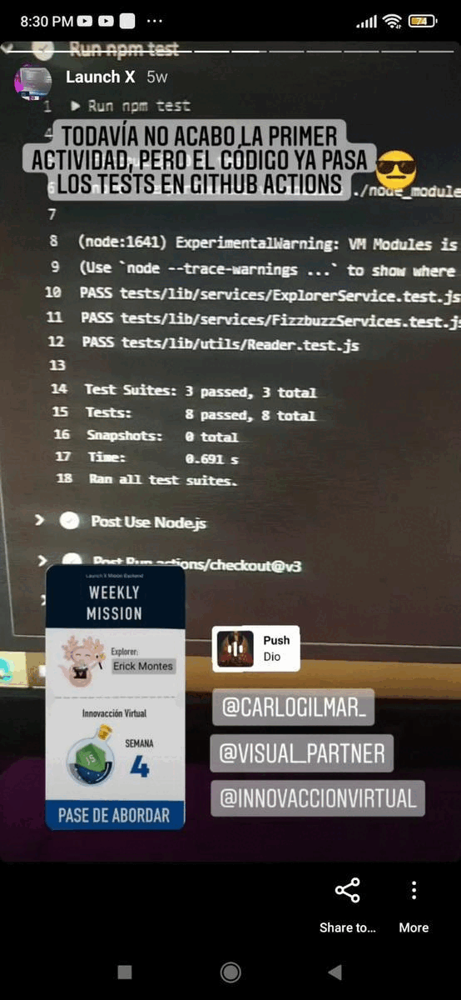

# Hello there... I'm Erick Montes 🦇

><i>I'm a Mechanical Engineer :wrench::triangular_ruler: and Web Developer :computer:</i>

   
  
  
  

## About me

If I have to describe me in one word, I would say "Designer". Since child I love to build my ideas into reality, and I had never changed that.
I studied Mechanical Engineering at the "Instituto Tecnológico de Morelia". I realized a few mechanical projects and participed in a congress 
<a href="https://static1.squarespace.com/static/55564587e4b0d1d3fb1eda6b/t/600b043fba40d129740e3133/1611334721131/Memorias+Academia+Journals+Celaya+2017+-+Tomo+00+-+Portada+e+%C3%8Dndice.pdf"><b><i>Academia Journals 2017</i></b></a>  

Then I made my intership at <a href="https://www.youtube.com/watch?v=ZpMH6E-fDDA&ab_channel=ZonaFrancaMX">Vetelia</a>, which was a electric bicycle designer and manufacturer industry.  There I designed a prototype for a electric motorcycle and helped in other people projects, designing their electric circuits. Even i helped with the electric instalation for a go kart.  

After I graduated, I tried to find my way. I made few projects, I entered and exited in a mastership. I worked in some things, but I recently find a way in wed design.
Studied, designed, and now here I am. 
Recently I participated in the "Hack The Ocean" contest, which my team won with our project <a href="https://ocex.netlify.app/">OCEX Encyclopedia</a>.
I still learning, but I need to go on

### Facts about
>* Introverted guy / Geek&Nerd 4life :no_mouth::sunglasses:
>* As hobby I read comics 🤖and go cycling 🚴. I like to make my own projects about 3d design and printing :space_invader:, electric circuits and now I practice programming. 
>* I need rock every single day :metal::cd:, starting for The Beatles, passing by Judas Priest, Metallica, and now Muse, Ghost, etc. 

## Skills
### As web developer

  
### 3D designer

   
### Other tools

## GitHub Stats

  

### Top Repositories

       
